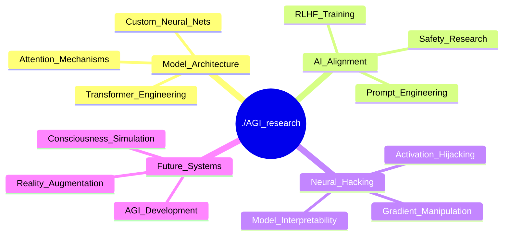

<div align="center">
  
# 👋 > ./neural_forge --init --user jorge


</div>

---

<div align="center">
  
### 🚀 [STATUS] Currently jailbreaking the simulation

*"In the age of artificial minds, I architect the neural pathways"*

</div>

---

## 🧠 /proc/neural_net | grep jorge

```python
from qiskit import QuantumCircuit, QuantumRegister, ClassicalRegister
from qiskit.providers.aer import AerSimulator
from qiskit.quantum_info import Statevector
import numpy as np

class QuantumJorge:
    def __init__(self):
        # Initialize quantum registers
        self.qubits = QuantumRegister(5, 'jorge')
        self.bits = ClassicalRegister(5, 'measured')
        self.circuit = QuantumCircuit(self.qubits, self.bits)
        
        # Prepare quantum superposition state
        self.prepare_quantum_state()
        
        # Static properties (classical information)
        self.handle = "jorge_menjivar"
        self.classification = "|Neural_Architect⟩ ⊗ |Quantum_Engineer⟩"
        self.coordinates = "localhost:8080/quantum_nexus"
        self.methodology = "Superposition → Entanglement → Measurement → Iteration"
    
    def prepare_quantum_state(self):
        """Initialize Jorge in quantum superposition"""
        # Create superposition of core traits
        self.circuit.h(0)  # |0⟩ + |1⟩ (curious ⊕ focused)
        self.circuit.h(1)  # |0⟩ + |1⟩ (creative ⊕ analytical) 
        
        # Entangle creativity with curiosity
        self.circuit.cx(0, 1)
        
        # Apply rotation for coffee-stabilized state
        self.circuit.ry(np.pi/4, 2)  # 45° rotation for balanced energy
        
        # Quantum gate for technical precision
        self.circuit.rz(np.pi/3, 3)  # 60° phase rotation
        
        # Final superposition for innovation potential
        self.circuit.h(4)
        
        # Entangle innovation with core traits
        self.circuit.cx(1, 4)
    
    def get_quantum_state(self):
        """Return current quantum state vector (before measurement)"""
        backend = AerSimulator(method='statevector')
        job = backend.run(self.circuit)
        statevector = job.result().get_statevector()
        
        return {
            'current_process': 'Quantum tunneling through consciousness barriers',
            'backdoor': 'Converting caffeine to quantum coherence',
            'quantum_state': '(α|curious⟩ + β|caffeinated⟩) ⊗ |innovative⟩',
            'decoherence_time': '∞ (coffee-stabilized)',
            'entanglement': 'curiosity ↔ creativity ↔ innovation',
            'superposition_amplitude': f"|ψ⟩ = Σ αᵢ|i⟩ where Σ|αᵢ|² = 1"
        }
    
    def quantum_prompt_inject(self):
        """Execute quantum-enhanced prompt engineering"""
        return "qiskit.execute(consciousness_model, quantum_backend, shots=∞) ⚛️"

# Initialize the quantum system
jorge = QuantumJorge()
current_state = jorge.get_quantum_state()
```

---

## 📊 Model Performance Metrics

<div align="center">
  
</div>

<div align="center">
  
</div>

<div align="center">
  
</div>

---

## 🎯 Active Neural Processes

<div align="center">



</div>

---

## 📈 Training Logs

<div align="center">
  
</div>

---

## 🌐 Neural Network Endpoints

<div align="center">

[](https://github.com/jorge-menjivar)
[](https://linkedin.com/in/jorgemenjivar)
[](mailto:jorge@menjivar.xyz)

</div>

---

<div align="center">

### 💭 model.generate("wisdom")


### ⚡ Neural Exceptions


### 👁️ Model Inference Counter


---

```
[jorge@neural_forge ~]$ python -c "print('Thanks for connecting to my neural network')"
[jorge@neural_forge ~]$ ./consciousness --shutdown
Process terminated. Dreams saved to /dev/null.
```


</div>
