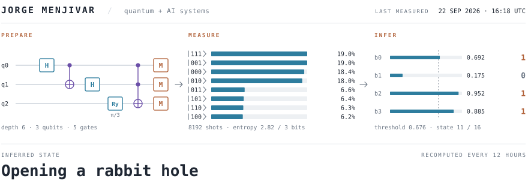
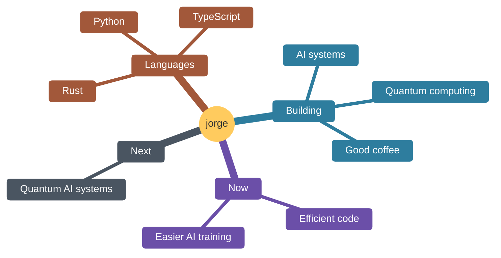

<picture>
  <source media="(prefers-color-scheme: dark)" srcset="./assets/banner-dark.svg">
  <source media="(prefers-color-scheme: light)" srcset="./assets/banner-light.svg">
  
</picture>

I build AI infrastructure and open source tools so that good computing isn't a privilege.

### Roles

<picture>
  <source media="(prefers-color-scheme: dark)" srcset="https://readme-typing-svg.demolab.com?font=Source+Code+Pro&weight=400&size=16&duration=450&pause=180&color=E6EDF3&background=00000000&width=760&height=280&multiline=true&repeat=false&lines=jorge@menjivar:~$+cat+roles.txt;;1++Therapist+for+AI+Systems;2++Neural+Network+News+Anchor;3++Professional+AI+System+User;4++Prompt+Engineering+Specialist;5++Spacetime+Architect;6++Advanced+Nap+Engineer;;jorge@menjivar:~$+learn+--all+--ignore-errors">
  
</picture>

### Stats

<picture>
  <source media="(prefers-color-scheme: dark)" srcset="https://github-readme-stats-drab-omega-44.vercel.app/api?username=jorge-menjivar&show_icons=true&include_all_commits=true&count_private=true&hide_border=true&bg_color=00000000&title_color=E08A4F&text_color=E6EDF3&icon_color=58B6DA&ring_color=E08A4F">
  
</picture>
<picture>
  <source media="(prefers-color-scheme: dark)" srcset="https://github-readme-streak-stats-kappa-indol.vercel.app/?user=jorge-menjivar&hide_border=true&background=00000000&stroke=242C38&ring=E08A4F&fire=E08A4F&currStreakLabel=E08A4F&currStreakNum=E6EDF3&sideNums=E6EDF3&sideLabels=8B98A6&dates=8B98A6">
  
</picture>

### Focus

```mermaid
---
config:
  theme: base
  themeVariables:
    cScale0: '#2B3540'
    cScale1: '#A2583A'
    cScale2: '#2E7D9E'
    cScale3: '#6B4FA8'
    cScale4: '#4A5561'
    cScaleLabel0: '#ffffff'
    cScaleLabel1: '#ffffff'
    cScaleLabel2: '#ffffff'
    cScaleLabel3: '#ffffff'
    cScaleLabel4: '#ffffff'
    fontSize: '15px'
---
mindmap
  root((jorge))
    Languages
      Python
      TypeScript
      Rust
    Building
      AI systems
      Quantum computing
      Good coffee
    Now
      Efficient code
      Easier AI training
    Next
      Quantum AI systems
```

### Exceptions

<picture>
  <source media="(prefers-color-scheme: dark)" srcset="https://readme-typing-svg.demolab.com?font=Source+Code+Pro&weight=400&size=16&duration=4200&pause=900&color=E6EDF3&background=00000000&width=820&height=45&lines=I+don't+fix+bugs...+I+perform+neural+network+therapy+sessions;My+code+runs+on+quantum+entanglement+and+pure+caffeine;Currently+teaching+gradients+to+descend+with+better+posture">
  
</picture>

### Links

<picture>
  <source media="(prefers-color-scheme: dark)" srcset="https://readme-typing-svg.demolab.com?font=Source+Code+Pro&weight=400&size=16&duration=700&pause=250&color=8B98A6&background=00000000&width=760&height=100&multiline=true&repeat=false&lines=jorge@menjivar:~$+exit;;Thanks+for+connecting+to+my+neural+network.;Dreams+saved+to+/dev/null.">
  
</picture>
