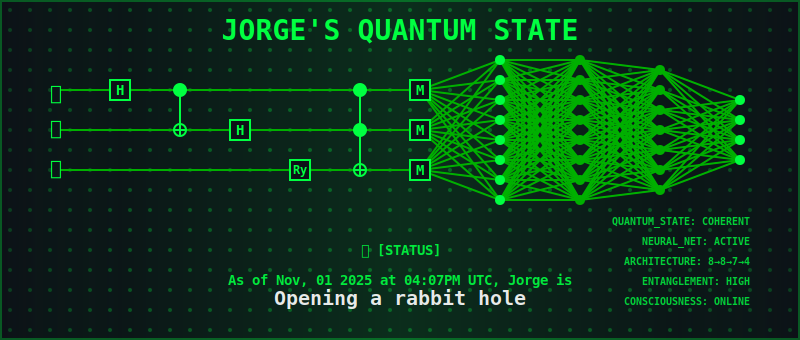

<!-- Custom Quantum Banner -->

# `> ssh jorge@menjivar`

---

### 📊 `python ./metrics.py`

---

### 🎯 `pnpm run neural_processes`

---

### 📈 `python ./logs.py`

---

### ⚡ `watch tail -n 1 ./exceptions.txt`

---

### 🌐 `curl -s https://menjivar.ai/openapi.json`

---

